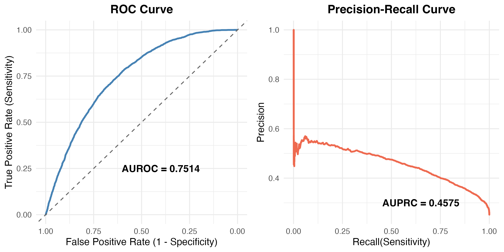
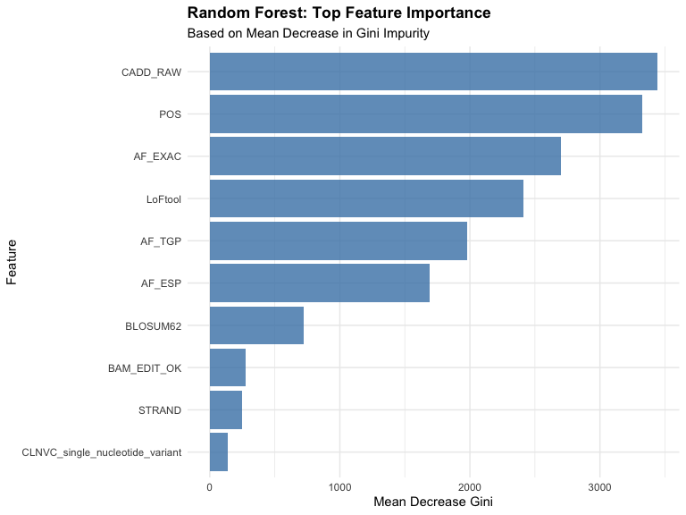
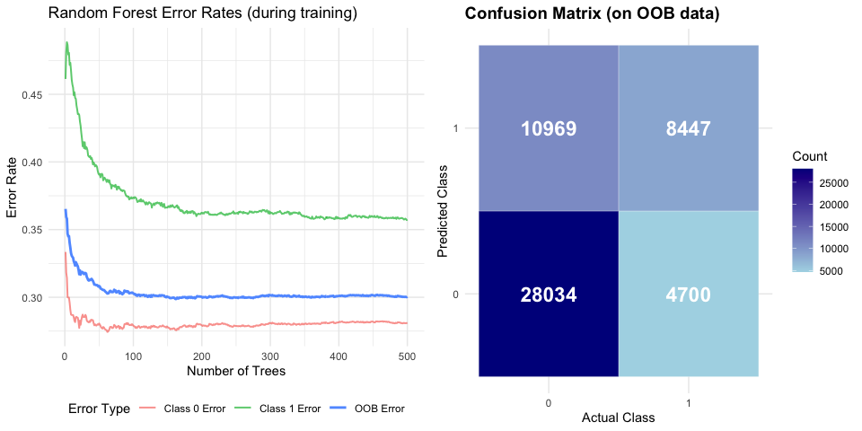

README
================

# ConflictPredictR: Predicting Interpretive Conflicts in Genetic Variants

<!-- badges: start -->

[](https://www.repostatus.org/#active)
[](https://opensource.org/licenses/MIT)
<!-- badges: end -->

## Overview

Conflicting interpretations of genetic variants in clinical databases
represent a significant challenge, creating uncertainty for clinicians
and patients. `ConflictPredictR` is a tool designed to address this
problem by predicting the likelihood that a variant will have a
conflicting classification.

Based on a pre-trained Random Forest model, this package calculates a
**“Conflict Risk Score”** for new variants. The model was chosen over
other alternatives for its robust performance and higher sensitivity in
identifying variants prone to conflicting interpretations. In addition
to prediction, the package provides functions for data validation and
visualizations to explain which genomic features most strongly drive
interpretive uncertainty.

## Key Features

- **Conflict Risk Prediction**: Delivers a “Conflict Risk Score” using a
  robust Random Forest model to identify variants prone to interpretive
  conflict.

- **Insightful Visualizations**: Understand the drivers of interpretive
  uncertainty with plots for feature importance (`plot_rf_importance()`)
  and model diagnostics (`plot_rf_diagnostics()`).

- **User-Friendly Data Validation**: Includes a `validate_input_data()`
  function that checks user data for common formatting issues and
  provides clear, actionable error messages.

- **Rigorously Tested**: The package is equipped with a suite of
  automated tests (`testthat`) and continuous integration to ensure
  functions behave reliably.

- **Transparent Model Selection**: The package includes a performance
  comparison table, openly showing why the Random Forest model (at 80%
  split) was chosen over XGBoost and Random Forest (at 90% split) for
  this specific task.

## Model Selection

This package is built around a single Random Forest (RF) model. During
development, other models like XGBoost were also evaluated. While all
models showed reasonable overall performance, this specific RF model(at
80% split) demonstrated higher Sensitivity in the task of identifying
conflict-prone variants (i.e., correctly identifying variants with CLASS
= 1).

This means the model is better at flagging variants that are genuinely
complex and likely to cause debate among experts. Minimizing false
negatives (i.e., failing to flag a truly conflict-prone variant) ensures
that this pre-warning system is effective.

| Indicator   | XGBoost | RF (90% Training) | RF (80% Training) |
|:------------|--------:|------------------:|------------------:|
| AUROC       |  0.7382 |            0.7397 |            0.7514 |
| AUPRC       |  0.4571 |            0.4612 |            0.4575 |
| Accuracy    |  0.7520 |            0.7530 |            0.6999 |
| Sensitivity |  0.2716 |            0.2944 |            0.6501 |
| Specificity |  0.9139 |            0.9076 |            0.7166 |
| Precision   |  0.5153 |            0.5179 |            0.4361 |
| F1-Score    |  0.2200 |            0.2355 |            0.5233 |

Model Performance Comparison

------------------------------------------------------------------------

## Model Performance

The performance of the Random Forest model (at 80% split) was evaluated
using AUROC and AUPRC.

|           ROC and PRC Curves            |
|:---------------------------------------:|
|  |
|     *AUROC: 0.7514, AUPRC: 0.4575*      |

------------------------------------------------------------------------

## Installation

You can install the development version of `ConflictPredictR` from
GitHub with:

``` r
# install.packages("devtools")
# devtools::install_github("Chenyu12161004/ConflictPredictR")
```

## Usage

First, load the package:

``` r
devtools::load_all()
```

### Data validation

Before making predictions, it is a good practice to validate the input
data. The `validate_input_data()` function checks for requirements.

``` r
# Validate the built-in sample data (this should pass)
validate_input_data(sample_variants)
```

### Predict Pathogenicity

Use `predict_conflict_risk()` on the sample data to get a risk score for
each variant.

``` r
# Use the sample data included in the package
predictions <- predict_conflict_risk(sample_variants)

# View the key prediction results
result_subset <- predictions[, c("CADD_PHRED", "CADD_RAW", ".pred_conflict_class", ".pred_conflict_risk")]
knitr::kable(head(result_subset))
```

Explanation of the new columns in the report:

- `.pred_conflict_class`: The final classification (1 = High Conflict
  Risk, 0 = Low Conflict Risk).
- `.pred_conflict_risk`: A score from 0 to 1 representing the predicted
  probability of the model that the variant will have a conflicting
  interpretation.

### Visualization: Understand Model Behavior

The package provides two functions to visualize what drives the
decisions of the model.

#### Feature Importance

`plot_rf_importance()` shows which features most influence the conflict
risk predictions of the model.

``` r
plot_rf_importance()
```

<!-- -->

#### Model Diagnostics

`plot_rf_diagnostics()` displays the internal training performance of
the model and its ability to classify variants based on their conflict
potential.

- **Out-of-Bag (OOB) Error Rate**: This plot shows the error rate of the
  model as it was being trained to distinguish between conflict-prone
  and consensus variants. It is generated from data stored within the
  model object and is static, reflecting the learning process of the
  model.

- **Confusion Matrix**: This plot evaluates the classification
  performance of the model on a specific dataset. It shows how well the
  model distinguishes between “High Conflict Risk” (`1`) and “Low
  Conflict Risk” (`0`) variants. By default, it uses the internal OOB
  data of the model. If you provide your own `newdata`, this plot will
  update to show the performance on that specific data.

``` r
plot_rf_diagnostics()
```

<!-- -->

------------------------------------------------------------------------

## About the Model

This package is built around a single machine learning model trained on
the ClinVar Conflicting dataset.

- **Data Preprocessing**: All data was prepared using a `recipes`
  pipeline. This process included handling missing values, converting
  categorical features into dummy variables, removing zero-variance
  predictors, and reducing high correlation between numeric features.

- **Random Forest Model**: Trained using the `randomForest` package with
  standard, empirically chosen parameters (`mtry` = sqrt(p), `ntree` =
  500).

The functions in this package are direct adaptations of the original
analysis script, ensuring that the research workflow is clear and
reproducible.
